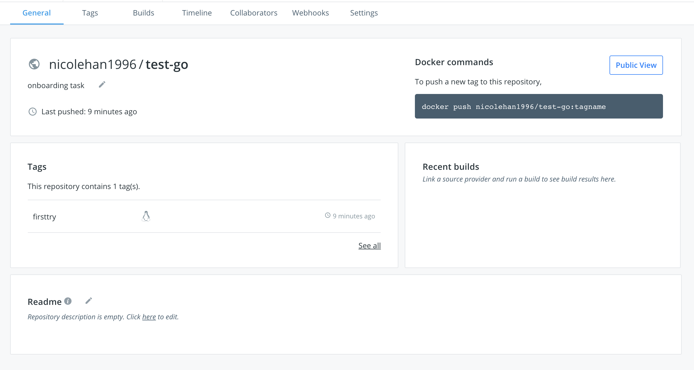

# Task 2
### Containerize the HTTP Server built in task #1 with Docker and push the image to a public registry on Docker Hub. 

Write a Dockerfile constructing the container in which our newly born Go application will live
```
$ docker build -t my-go-app .
```
see the output, we've run through all the commands we defined in the Dockerfile

now verify the image exists:
```
$ docker images
REPOSITORY                                     TAG                                 IMAGE ID            CREATED              SIZE
my-go-app                                      latest                              dfc4a53db55e        About a minute ago   362MB
```
<br>

pass in the ports we want to map to and the image we wish to run

```
$ docker run -p 8081:8083 -d my-go-app
```

if we open up http://localhost:8081 within our browser

we should see that our application is successfully responding, we see the following:

```
2021-07-28 23:22:44.2948814 +0000 UTC
TIMEZONE: 
```

<br>
You’ll notice that if we ctrl-c this within the terminal, it will kill the container. 

If we want to have it run permanently in the background, you can replace "-it" with "-d" to run this container in detached mode.

```
$ docker run -p 8081:8083 -d my-go-app
53a282918b4e3b0b0862894f8e1b5553d36dceb72d8fc9f29844724c897d9432
$ docker ps
CONTAINER ID   IMAGE                  COMMAND                  CREATED              STATUS              PORTS                                       NAMES
b1f41bcaf984   my-go-app              "/app/main"              About a minute ago   Up 59 seconds       0.0.0.0:8081->8083/tcp, :::8081->8083/tcp   naughty_cannon
```
We can kill this container by running "docker kill <container_id>"

<br>
push a new image to a registry, first find the container ID:

```
$ docker ps
$ docker commit df52d45df3fe my-go-image
$ docker login --username=[YOUR DOCKER USER NAME]
``` 

7764xxx is the image id we get by running "docker images", "firsttry" is the tag
```
$ docker tag 77641b34e758 nicolehan1996/test-go:firsttry
$ docker push nicolehan1996/test-go
```
Now the image is now available for everyone to use!



